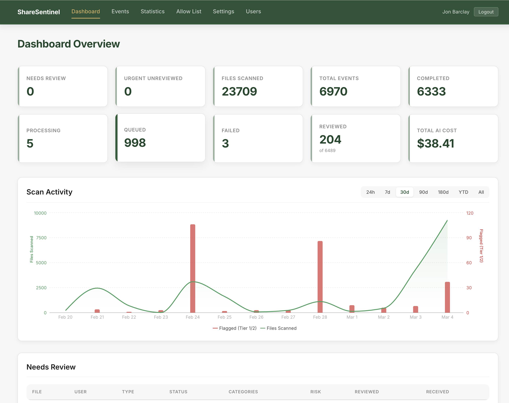

# ShareSentinel

[](LICENSE)

Automated monitoring and sensitivity analysis for OneDrive/SharePoint file sharing activity.

## Overview

ShareSentinel is a containerized system that monitors OneDrive and SharePoint for anonymous and organization-wide sharing links. When a user creates a broad sharing link, ShareSentinel automatically downloads the shared file, extracts its text content, and submits it to an AI model for sensitivity analysis. If the AI detects sensitive content -- such as PII, FERPA-protected records, HIPAA data, or security credentials -- analysts are immediately notified with the file metadata, sensitivity findings, and a direct link to the shared item.

The system polls the Microsoft Graph Audit Log Query API every 15 minutes for `AnonymousLinkCreated` and `CompanyLinkCreated` events. Events are deduplicated via Redis and processed by a worker service that handles up to 5 jobs concurrently. The worker supports multiple processing paths depending on file type: text extraction for documents, multimodal analysis for images, audio/video transcription, and browser-based inspection for delegated content types like Loop, OneNote, and Whiteboard.

Beyond detection, ShareSentinel enforces a 180-day expiration policy on sharing links. Each anonymous or organization-wide link is enrolled in a lifecycle tracker that sends countdown notifications to file owners at scheduled milestones, then automatically removes the link via the Graph API at expiration.

ShareSentinel also enforces site-level sharing policies. A daily scanner checks all M365 groups and SharePoint sites against configurable allow lists. Groups set to Public that are not allow-listed are automatically switched to Private. Sites with anonymous sharing enabled that are not allow-listed have their sharing capability downgraded. Administrators manage allow lists through the dashboard, and changes trigger immediate enforcement.

A web dashboard gives analysts a centralized view of events, AI verdicts, sharing link status, and site policy enforcement history.



## Architecture

```
                    Microsoft Graph
                    Audit Log Query API
                           |
                           v
                  +------------------+
                  | lifecycle-cron   |
                  |  - audit poller  |----> Redis Queue ----> +----------+
                  |  - lifecycle     |                        |  worker  |
                  |    processor     |                        +----------+
                  +------------------+                          |  |  |
                           |                     +--------------+  |  +--------------+
                           |                     v                 v                 v
                           |               Graph API         AI Providers      PostgreSQL
                           |            (download files)   (Anthropic/OpenAI/   (events,
                           |                                    Gemini)         verdicts)
                           v                                      |
                         SMTP  <----------------------------------+
                    (countdown emails,                        (analyst alerts)
                     analyst alerts)
                                            +-------------+
                                            |  dashboard  |
                                            | (React +    |----> PostgreSQL
                                            |  FastAPI)   |
                                            +-------------+
                                                  |
                                                  v
                                            Inspection Queue
                                          (Playwright browser
                                           screenshots for
                                           delegated content)
```

## Containers

| Container | Description |
|---|---|
| **lifecycle-cron** | Runs up to four concurrent loops: (1) audit log poller that queries the Graph API every 15 minutes for new sharing events and pushes them to the Redis queue, (2) lifecycle processor that checks sharing link expiry milestones daily, sends countdown notifications, and removes expired links, (3) site policy scanner that enforces M365 group visibility and SharePoint anonymous sharing policies daily, and (4) folder rescan that re-checks shared folders for new/modified files weekly. |
| **worker** | Python service that pulls jobs from Redis (up to 5 concurrently), orchestrates the full processing pipeline: metadata pre-screen, download, text extraction, AI analysis, lifecycle enrollment, notification, and cleanup. |
| **dashboard** | React + FastAPI web UI for analysts to review events, verdicts, statistics, manage site policy allow lists (sharing + visibility), and process delegated content types via the Inspection Queue. |
| **redis** | Job queue, deduplication cache, and rate limiting state. |
| **postgres** | Event records, AI verdicts, analyst dispositions, sharing link lifecycle tracking, audit poll state, site policy allow lists, and site policy enforcement history. |

## Prerequisites

- Docker Engine 27+ and Docker Compose v2+
- Microsoft 365 tenant with a [Microsoft Entra ID app registration](#microsoft-entra-id-setup)
- At least one AI provider key (Anthropic, OpenAI, or Gemini)
- SMTP relay account for notifications
- TLS certificate and key in `nginx/certs/` for production use

## Microsoft Entra ID Setup

ShareSentinel uses the Microsoft Graph API with application-level permissions to monitor sharing activity, download files, read audit logs, and remove expired sharing links. This section walks through the required Azure app registration and permission setup.

> **Security Warning**
>
> The permissions required by ShareSentinel are broad and highly privileged:
>
> - **`Files.Read.All`** -- read access to all files across OneDrive and SharePoint in the tenant
> - **`Sites.Read.All`** -- read access to all SharePoint site metadata and content
> - **`Sites.FullControl.All`** -- full control of all SharePoint sites (used to remove sharing links)
> - **`Group.ReadWrite.All`** -- read/write access to all M365 groups (used to enforce visibility policy)
> - **`AuditLogsQuery.Read.All`** -- read access to all Microsoft 365 audit logs
>
> Use a dedicated, monitored app registration for ShareSentinel. Review permissions carefully, enable audit logging on the app registration itself, and restrict access to the client secret or certificate. Do not reuse this registration for other purposes.

### Step 1: Create the App Registration

1. Navigate to the [Azure Portal](https://portal.azure.com) > **Microsoft Entra ID** > **App registrations** > **New registration**.
2. Name: `ShareSentinel` (or your preferred name).
3. Supported account types: **Accounts in this organizational directory only** (single tenant).
4. Redirect URI: leave blank for now (only needed if configuring [Dashboard SSO](#step-6-optional-dashboard-sso-oidc)).
5. Click **Register**.
6. Note the **Application (client) ID** and **Directory (tenant) ID** from the overview page -- you will need these for `.env`.

### Step 2: Configure API Permissions

Add the following **Application** permissions under **Microsoft Graph**:

| Permission | Type | Purpose |
|---|---|---|
| `Files.Read.All` | Application | Download shared files for sensitivity analysis |
| `Sites.Read.All` | Application | Read SharePoint site metadata, enumerate folder contents |
| `Sites.FullControl.All` | Application | Remove expired sharing links (lifecycle enforcement) |
| `Group.ReadWrite.All` | Application | Enforce M365 group visibility policy (set Public groups to Private) |
| `AuditLogsQuery.Read.All` | Application | Poll Microsoft 365 audit log for sharing events |

**To add permissions:**

1. Go to your app registration > **API permissions** > **Add a permission**.
2. Select **Microsoft Graph** > **Application permissions**.
3. Search for and add each permission listed above.
4. Click **Grant admin consent for [your tenant]** (requires Global Administrator or Privileged Role Administrator).

If you plan to use the [Teams transcript pipeline](#step-5-optional-teams-transcript-access), also add these optional permissions now:

| Permission | Type | Purpose |
|---|---|---|
| `OnlineMeetings.Read.All` | Application | Query Teams meetings to locate transcripts |
| `OnlineMeetingTranscript.Read.All` | Application | Read meeting transcript content |

### Step 3: Certificate Authentication

ShareSentinel supports both client secret and certificate authentication. **Certificate authentication is recommended for production.**

To use certificate authentication:

1. Obtain a PFX (PKCS#12) certificate file with a password protecting the private key.
2. Upload the certificate's **public key** to the app registration: go to **Certificates & secrets** > **Certificates** > **Upload certificate**, and upload the `.cer` or `.pem` public key file.
3. Place the PFX file at the project root (default path: `./graph-api-cert.pfx`) or set the `AZURE_CERTIFICATE` environment variable to its path.
4. Set `AZURE_CERTIFICATE_PASS` to the PFX password.

At runtime, the app extracts the private key and computes the SHA-1 thumbprint automatically via MSAL. If no certificate is configured, the app falls back to the client secret (`AZURE_CLIENT_SECRET`).

### Step 4: Grant Loop File Access (SharePoint Embedded)

Microsoft Loop files are stored in SharePoint Embedded (SPE) containers owned by the Microsoft Loop application. Standard Graph API permissions are not sufficient to read Loop content -- you must explicitly grant your app read access to Loop's containers.

Run the following in the **SharePoint Online Management Shell**:

```powershell
# Install the SharePoint Online Management Shell (if not already installed)
Install-Module -Name Microsoft.Online.SharePoint.PowerShell -Force

# Connect to SharePoint Online admin
Connect-SPOService -Url https://yourtenant-admin.sharepoint.com

# Grant ShareSentinel read access to Microsoft Loop's SPE containers
# OwningApplicationId: Microsoft Loop's well-known app ID (do not change)
# GuestApplicationId: Your ShareSentinel app registration's client ID
Set-SPOApplicationPermission `
    -OwningApplicationId 'a187e399-0c36-4b98-8f04-1edc167a0996' `
    -GuestApplicationId '<your-sharesentinel-client-id>' `
    -PermissionAppOnly ReadContent
```

> **Note:** The `OwningApplicationId` value `a187e399-0c36-4b98-8f04-1edc167a0996` is Microsoft Loop's well-known application ID -- do not change it. Replace `<your-sharesentinel-client-id>` with the Application (client) ID from Step 1.

### Step 5 (Optional): Teams Transcript Access

For organizations using the audio/video transcription pipeline, you need a Teams Application Access Policy in addition to the Graph API permissions added in [Step 2](#step-2-configure-api-permissions).

```powershell
# Install the Teams PowerShell module (if not already installed)
Install-Module -Name MicrosoftTeams -Force -AllowClobber

# Connect to Teams
Connect-MicrosoftTeams

# Create the application access policy
New-CsApplicationAccessPolicy `
    -Identity "ShareSentinel-TranscriptPolicy" `
    -AppIds "<your-sharesentinel-client-id>" `
    -Description "Allow ShareSentinel to read meeting transcripts"

# Grant the policy globally (all users)
Grant-CsApplicationAccessPolicy `
    -PolicyName "ShareSentinel-TranscriptPolicy" `
    -Global
```

> **Note:** After creating the policy, it can take **up to 30 minutes** to propagate across the Teams infrastructure.

### Step 6 (Optional): Dashboard SSO (OIDC)

The dashboard supports Entra ID single sign-on via OpenID Connect. You can use the same app registration or create a separate one.

1. In the app registration, go to **Authentication** > **Add a platform** > **Web**.
2. Set the redirect URI to `https://sharesentinel.yourorg.com/api/auth/callback` (adjust the domain to match your deployment).
3. Under **Certificates & secrets**, create a **client secret** for the OIDC flow.
4. Under **Token configuration** > **Add optional claim** > **ID** token, add `email` and `groups` claims.
5. Create Entra ID security groups for access control (e.g., `ShareSentinel-Dashboard`, `ShareSentinel-Dashboard-Admin`) and assign users.
6. Configure the `OIDC_*` environment variables in `.env` (see [.env.example](.env.example)).

## Quick Start

```bash
git clone https://github.com/your-org/ShareSentinel.git
cd ShareSentinel
cp .env.example .env
# Complete the Entra ID setup above, then edit .env with your
# Azure AD credentials, AI API keys, and SMTP settings
docker compose up --build -d
```

## First-Run Verification

```bash
# Validate compose and env interpolation
docker compose config >/dev/null

# Check service health
docker compose ps
curl -k https://localhost/api/health
```

Expected health response:

```json
{"status":"ok"}
```

## Pre-Public-Repo Checklist

Before converting the repository from private to public:

1. Run the built-in audit script: `./scripts/pre_public_check.sh`
2. Rotate all production credentials (Azure app secret/cert password, AI keys, SMTP/Jira tokens, Redis/Postgres passwords).
3. Confirm no secret files are tracked:
   - `.env`, certificate/private key files, database dumps, and backups should remain ignored.
   - Run `git ls-files | rg -n '(\\.env|\\.pfx|\\.pem|\\.key|backup|dump)'` and verify there are no sensitive hits.
4. Check git history for accidental token commits:
   - Run `git log --all --full-history -- .env '*.pfx' '*.pem' '*.key'`.
5. Review organization-specific strings:
   - Replace internal domains/emails and branding if you do not want them in public source.
6. Enable GitHub branch protection and keep security workflows enabled (`dependency-check.yml`, `security-scans.yml`).
7. Publish a security contact process (already documented in `SECURITY.md`).

## Configuration

All configuration is via environment variables. See [.env.example](.env.example) for the full list.

| Category | Key Variables | Description |
|---|---|---|
| **Azure AD** | `AZURE_TENANT_ID`, `AZURE_CLIENT_ID`, `AZURE_CLIENT_SECRET` | App registration for Microsoft Graph API access. Requires `Files.Read.All`, `Sites.Read.All`, `Sites.FullControl.All`, `Group.ReadWrite.All`, and `AuditLogsQuery.Read.All` permissions. |
| **AI Providers** | `AI_PROVIDER`, `ANTHROPIC_API_KEY`, `OPENAI_API_KEY`, `GEMINI_API_KEY` | AI provider selection and API keys. Supports `anthropic`, `openai`, and `gemini`. |
| **SMTP** | `SMTP_HOST`, `SMTP_PORT`, `SMTP_USERNAME`, `SMTP_PASSWORD` | Email server for analyst alerts and lifecycle countdown notifications. |
| **PostgreSQL** | `DATABASE_URL` | Connection string for the PostgreSQL database. |
| **Redis** | `REDIS_URL` | Connection string for the Redis instance. |

## Sensitivity Categories

The AI returns detected sensitivity categories organized into tiers. Escalation is deterministic: any Tier 1 or Tier 2 category triggers analyst notification.

| Tier | Level | Categories |
|---|---|---|
| **Tier 1** | Urgent | `pii_government_id`, `pii_financial`, `ferpa`, `hipaa`, `security_credentials` |
| **Tier 2** | Normal | `hr_personnel`, `legal_confidential`, `pii_contact` |
| **Tier 3** | No escalation | `coursework`, `casual_personal`, `none` |

## Processing Paths

| Scenario | Processing Path |
|---|---|
| **Text-extractable files** (PDF, DOCX, XLSX, PPTX, CSV, TXT) | Text extraction via PyMuPDF, python-docx, openpyxl, python-pptx, or direct read, then AI text analysis. |
| **Images and scanned documents** (PNG, JPG, TIFF, scanned PDFs) | OCR via Tesseract, or resize/compress and send to AI as multimodal input. |
| **Audio and video** (MP3, WAV, MP4, MOV, etc.) | Transcription pipeline, then AI text analysis on the transcript. |
| **Delegated content** (Loop, OneNote, Whiteboard) | Parked as `pending_manual_inspection`, processed via the dashboard's Inspection Queue using Playwright browser screenshots with saved authentication cookies, then multimodal AI analysis. |
| **Oversized files** (> 50 MB) or **excluded types** (binaries) | Filename, file path, file size, and sharing metadata sent to AI for assessment. |
| **Folder shares** | Child files enumerated and analyzed individually; folder also flagged for analyst review (future files inherit sharing scope). |

## Sharing Link Lifecycle

All anonymous and organization-wide sharing links are enrolled in a 180-day lifecycle tracker. Links with a Microsoft-set expiration date are marked `ms_managed` and exempt from countdown notifications.

| Days Elapsed | Action | Days Remaining |
|---|---|---|
| 120 | First countdown email to file owner | 60 |
| 150 | Second countdown email | 30 |
| 165 | Third countdown email | 15 |
| 173 | Urgent reminder email | 7 |
| 178 | Final warning email | 2 |
| 180 | Remove link via Graph API + confirmation email | 0 |

The lifecycle processor runs daily in the lifecycle-cron container.

## Site Policy Enforcement

ShareSentinel enforces two site-level policies via allow lists managed through the dashboard:

### Visibility Policy (M365 Groups)

All M365 Unified groups are expected to be Private. A daily scan enumerates all groups via the Graph API, identifies Public groups not on the visibility allow list, and sets them to Private via `PATCH /groups/{id}`. Requires the `Group.ReadWrite.All` application permission.

### Sharing Capability Policy (SharePoint Sites)

All SharePoint sites are expected to block anonymous sharing. A daily scan enumerates all site collections via the SharePoint CSOM tenant admin API, identifies sites with `SharingCapability = ExternalUserAndGuestSharing` that are not on the sharing allow list, and downgrades them to `ExternalUserSharingOnly`. Requires the `SHAREPOINT_ADMIN_URL` environment variable and certificate-based auth to the SharePoint admin site.

### Immediate Enforcement

When an administrator adds or removes a site from either allow list via the dashboard, the change is applied immediately (not waiting for the next daily scan). The dashboard pushes an action to Redis, and the lifecycle-cron container picks it up within 60 seconds.

### Configuration

| Variable | Description | Default |
|---|---|---|
| `SITE_POLICY_ENABLED` | Enable/disable site policy enforcement | `false` |
| `SITE_POLICY_INTERVAL_HOURS` | Hours between scheduled scans | `24` |
| `SITE_POLICY_ENABLED_SHARING_CAPABILITY` | Capability set on allow-listed sites | `ExternalUserAndGuestSharing` |
| `SITE_POLICY_DISABLED_SHARING_CAPABILITY` | Capability set on non-allow-listed sites | `ExternalUserSharingOnly` |
| `SHAREPOINT_ADMIN_URL` | SharePoint tenant admin URL | _(required)_ |

## Key Design Decisions

- **Text extraction first, multimodal as fallback.** Text-based AI calls are significantly cheaper and often more accurate. Multimodal analysis is reserved for actual images and documents where text extraction fails.
- **Files never touch persistent disk.** All downloads go to a tmpfs (RAM-backed) mount in the worker container. Files are explicitly deleted after processing and automatically cleaned on container restart.
- **AI provider is swappable via configuration.** Switching between Anthropic Claude, OpenAI, and Google Gemini requires only a configuration change. All providers implement the same interface and return the same structured output format.
- **Deterministic escalation.** Any Tier 1 or Tier 2 sensitivity category triggers analyst notification. There is no configurable threshold or scoring -- the system either escalates or it does not.
- **Folder shares are always flagged.** Even if all current child files are benign, the broad sharing scope means future files will inherit it, so analysts are always notified.
- **Site policies use dual allow lists.** Visibility (Public/Private) and sharing capability (anonymous link enablement) are separate concerns with separate allow lists. The Graph API handles group visibility changes, while the SharePoint CSOM tenant admin API handles per-site sharing capability (because Graph doesn't support it).
- **Allow list changes are enforced immediately.** Adding or removing a site from an allow list triggers an immediate enforcement action via Redis, rather than waiting for the next daily scan.

## Documentation

Detailed specifications for each component are in the [`docs/`](docs/) directory:

1. [Architecture Overview](docs/01-architecture-overview.md) -- System architecture, data flow, container layout, technology rationale
2. [Event Ingestion Service](docs/02-event-ingestion-service.md) -- Audit log poller, Graph API query flow, event-to-job mapping
3. [File Processing Pipeline](docs/03-file-processing-pipeline.md) -- Worker orchestration: metadata pre-screen, download, classification, routing
4. [Text Extraction Module](docs/04-text-extraction-module.md) -- Extraction strategies per file type, sampling logic, OCR fallback
5. [Image Preprocessing Module](docs/05-image-preprocessing-module.md) -- Image resizing, compression, scanned PDF rendering, multimodal preparation
6. [AI Provider Abstraction](docs/06-ai-provider-abstraction.md) -- Provider interface, prompt management, structured output parsing, cost tracking
7. [Database Schema](docs/07-database-schema.md) -- PostgreSQL tables, indexes, audit logging, migration strategy
8. [Notification Service](docs/08-notification-service.md) -- Email alerting, Jira integration, notification interface design
9. [Configuration & Deployment](docs/09-configuration-deployment.md) -- Docker Compose setup, environment variables, secrets, health checks
10. [Testing & Calibration](docs/10-testing-calibration.md) -- Test strategy, AI benchmarking, sample file creation, validation methodology

## Contributing

Contributions are welcome. See [CONTRIBUTING.md](CONTRIBUTING.md) for guidelines.

## License

This project is licensed under the MIT License. See [LICENSE](LICENSE) for details.
